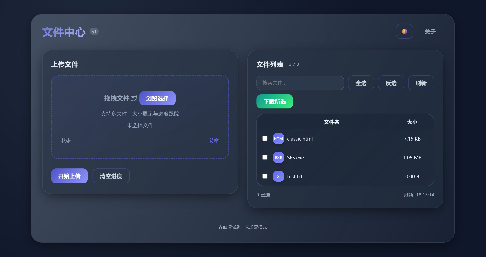

# 📁 简易文件上传与下载服务 / Simple File Upload & Download Server

- [中文说明](#中文说明) | [English Guide](#english-guide)

---




## 中文说明

### 简介
一个基于 Python 内置 `http.server` 的极简文件上传/下载小服务，单文件运行，带前端页面（进度条、深色模式自适应）与可选的一次性密钥访问控制。

- 入口文件：`file.py`
- 运行环境：Python 3.8+
- 平台：Windows / macOS / Linux

### 功能
- 上传多个文件（multipart/form-data），支持实时速度与 ETA 显示
- 下载文件（浏览器或命令行），支持断点续传与 HTTP Range 请求
- 文件列表（名称 + 大小），支持 HEAD 请求获取文件元数据
- 进度条与智能上传速度显示（小文件使用平均速度）
- 增强型现代界面（卡片式布局、优化的视觉效果）
- 拖拽上传支持
- 手动主题切换（浅色/深色/自动）
- 主题色彩定制（7种预设颜色和重置选项）
- 文件搜索与批量操作（防弹窗拦截的顺序下载）
- 实时速度与预计完成时间显示
- 响应式设计，支持移动设备
- 可选加密模式：一次性 4 位密钥（请求头 `X-Secret-Key`）
- 经典界面模式（通过 `-c` 参数启用）
- 终端显示服务器 URL 和二维码（可选，需要 qrcode 模块）

### 快速开始
1. 安装 Python 3.8+ 并确保命令行可用 `python`。
2. 启动服务：
   - 默认 80 端口（Windows 可能需要管理员权限）：
     ```powershell
     python file.py
     ```
   - 自定义端口（推荐 8000）：
     ```powershell
     python file.py -p 8000
     ```
   - 启用加密模式：
     ```powershell
     python file.py -p 8000 -e
     ```
   - 启用经典界面模式：
     ```powershell
     python file.py -p 8000 -c
     ```
3. 浏览器访问：
   ```
   http://localhost:PORT/
   ```
   上传的文件保存到启动目录。

### 命令行参数
- `-p, --port` 指定服务端口（默认 80）
- `-e, --encrypted` 启用一次性密钥模式
- `-c, --classic` 启用经典模式，使用传统界面

加密模式下，控制台会显示 4 位密钥，客户端需在请求头携带 `X-Secret-Key`。

### 前端使用
**新界面（默认）：**
- 上传：拖拽文件到上传区域或点击"浏览选择"，支持多文件上传，实时显示上传进度、速度和预计完成时间
- 列表：自动加载文件列表，支持搜索过滤、全选/反选、批量下载
- 主题：点击右上角主题按钮切换浅色/深色/自动模式
- 主题色：点击调色板按钮（🎨）选择预设颜色或重置为默认主题
- 下载：选中文件后点击"下载所选"，支持批量下载和断点续传

**经典界面（`-c` 启用）：**
- 上传：选择文件后点击"上传"，如启用加密模式会弹窗输入密钥
- 列表：点击"刷新列表"获取服务器当前目录文件
- 下载：选中文件后点击"下载所选"

> 端口 80 通常需管理员权限，推荐 `-p 8000`。
> 当前目录所有普通文件都会出现在列表中。

### 接口说明
- `GET /` 返回前端页面
- `GET /list` 列出当前目录文件（JSON），可选 `X-Secret-Key`
- `GET /download?file=<name>` 下载指定文件，支持 HTTP Range 请求断点续传，可选 `X-Secret-Key`
- `HEAD /download?file=<name>` 获取文件元数据（大小、类型、Range 支持），不下载文件内容，可选 `X-Secret-Key`
- `POST /upload` 上传文件（multipart/form-data，字段名 `file`），可选 `X-Secret-Key`

### 加密模式说明
- 启用 `-e` 后，所有接口校验 `X-Secret-Key`。
- 前端上传/刷新会弹窗输入密钥。

### 安全与注意事项
- 仅用于局域网/临时传输，无权限隔离和传输加密
- Python `cgi` 模块已废弃，未来可能移除。

### 故障排查
- 权限/端口占用：用 `-p 8000` 或管理员权限。
- 上传 400：确认 Content-Type 和字段名。

### 预编译可执行文件

预编译的可执行文件可从 [发布页面](https://github.com/yanjing19989/simple-file-upload-download-server/releases) 下载。CI 创建两种构建方式：

**目录构建**（推荐，启动更快）：
- Linux: `SFS-linux.tar.gz`
- Windows: `SFS-windows.zip`

**单文件构建**（便携，但启动稍慢）：
- Linux: `SFS-onefile`（包含在 tar.gz 中）
- Windows: `SFS-onefile.exe`（包含在 zip 中）

解压后运行可执行文件。静态资源（`static/`）已通过 `--add-data` 嵌入到可执行文件中。

> 注意：目录构建会在 `dist` 中生成名为 `SFS` 的文件夹，包含可执行文件和 `_internal` 目录（包含依赖和静态资源）。

---

### 从源码构建

项目包含 GitHub Actions CI/CD，使用 PyInstaller 构建可执行文件。CI 通过 `--add-data` 标志将静态资源嵌入到构建中。要在本地构建：

1. 安装 PyInstaller 和 qrcode（可选）：
   ```powershell
   pip install pyinstaller qrcode
   ```
2. 目录构建（推荐）：
   ```powershell
   pyinstaller -D file.py -n SFS --add-data static:static
   ```
   或单文件构建：
   ```powershell
   pyinstaller -F file.py -n SFS-onefile --add-data static:static
   ```

> 提示：`--add-data` 使用 `:` 作为分隔符（在 Windows 上使用 `;`）。格式：`源路径:目标路径`

---

## English Guide

### Introduction
A tiny file upload/download server built on Python's built-in `http.server`. Single-file runnable, includes a minimal frontend (progress bar, auto dark mode) and an optional one-time key access control.

- Entry: `file.py`
- Runtime: Python 3.8+
- Platforms: Windows / macOS / Linux

### Features
- Multi-file upload (multipart/form-data) with real-time speed and ETA display
- File download (browser or CLI), supports resuming with HTTP Range requests
- File listing (name + size), supports HEAD requests for file metadata
- Upload progress with intelligent speed display (average speed for small files)
- Enhanced modern interface (card layout with optimized visual effects)
- Drag and drop file upload support
- Manual theme switching (light/dark/auto)
- Theme color customization (7 preset colors and reset option)
- File search and bulk operations (sequential downloads to prevent popup blocking)
- Real-time speed and ETA display
- Responsive design for mobile devices
- Optional encrypted mode: one-time 4-digit key (via `X-Secret-Key` header)
- Classic interface mode (enabled via `-c` flag)
- Terminal displays server URL and QR code (optional, requires qrcode module)

### Quick Start
1. Install Python 3.8+ and ensure `python` is available in your shell.
2. Start the server:
   - Default port 80 (may require admin privileges on Windows):
     ```powershell
     python file.py
     ```
   - Custom port (recommend 8000):
     ```powershell
     python file.py -p 8000
     ```
   - Enable encrypted mode:
     ```powershell
     python file.py -p 8000 -e
     ```
   - Enable classic interface mode:
     ```powershell
     python file.py -p 8000 -c
     ```
3. Visit in browser:
   ```
   http://localhost:PORT/
   ```
   Uploaded files are saved to the process working directory.

### CLI Options
- `-p, --port` Specify the server port (default 80)
- `-e, --encrypted` Enable one-time key mode
- `-c, --classic` Enable classic mode with traditional interface

When encrypted mode is enabled, the program prints a one-time 4-digit key and requires clients to include it in the `X-Secret-Key` request header.

### Frontend Usage
**Enhanced Interface (Default):**
- Upload: Drag files to upload area or click "Browse" button. Supports multi-file upload with real-time progress, speed, and ETA display
- List: Auto-loads file list with search filtering, select all/invert selection, and bulk download support
- Theme: Click theme button in top-right corner to switch between light/dark/auto modes
- Color Theme: Click color palette button (🎨) to select preset colors or reset to default theme
- Download: Select files and click "Download Selected" for bulk downloads, supports resuming

**Classic Interface (`-c` enabled):**
- Upload: Select files, click Upload. If encrypted mode is on, the page prompts for the key
- List: Click Refresh to fetch all files in the server's current directory
- Download: Select files and click Download Selected to open downloads in new windows

> Port 80 often requires admin privileges on Windows; prefer `-p 8000`.
> All regular files in the current working directory appear in the list.

### API
- `GET /` Returns the built-in HTML frontend
- `GET /list` List files in current dir (JSON), optional `X-Secret-Key`
- `GET /download?file=<name>` Download a specific file with HTTP Range request support for resumable downloads, optional `X-Secret-Key`
- `HEAD /download?file=<name>` Get file metadata (size, content-type, range support) without downloading content, optional `X-Secret-Key`
- `POST /upload` Upload one or more files in multipart/form-data under the `file` field, optional `X-Secret-Key`

### Encrypted Mode Notes
- With `-e`, the server validates `X-Secret-Key` for all endpoints.
- The frontend prompts for the key for Upload and List.

**Workarounds:**
- Temporarily avoid encrypted mode for downloads; or
- Use a CLI tool that can add headers, e.g.:

### Security Notes
- Intended for LAN/temporary use; no auth roles or auditing.
- Python's `cgi` module is deprecated since 3.11 and may be removed in future.

### Troubleshooting
- Permission/port issues: use `-p 8000` or run as admin.
- Upload 400: ensure `multipart/form-data` with field name `file`.

### Pre-built Binaries

Pre-built executables for Windows and Linux are available from the project's [Releases page](https://github.com/yanjing19989/simple-file-upload-download-server/releases). The CI creates two types of builds:

**Directory builds** (recommended, faster startup):
- Linux: `SFS-linux.tar.gz`
- Windows: `SFS-windows.zip`

**Single-file builds** (portable, slightly slower startup):
- Linux: `SFS-onefile` (included in tar.gz)
- Windows: `SFS-onefile.exe` (included in zip)

After extraction, run the executable. Static assets (`static/`) are embedded in the executables using `--add-data` flag.

> Note: Directory builds generate a `SFS` folder under `dist` containing the executable and `_internal` directory (with dependencies and static assets).

---

### Building from Source

The project includes a GitHub Actions CI that builds binaries using PyInstaller. The CI embeds static assets using the `--add-data` flag. To build locally:

1. Install PyInstaller and qrcode (optional):
   ```powershell
   pip install pyinstaller qrcode
   ```
2. Directory build (recommended):
   ```powershell
   pyinstaller -D file.py -n SFS --add-data static:static
   ```
   Or single-file build:
   ```powershell
   pyinstaller -F file.py -n SFS-onefile --add-data static:static
   ```

> Tip: `--add-data` uses `:` as separator (use `;` on Windows). Format: `source_path:destination_path`


